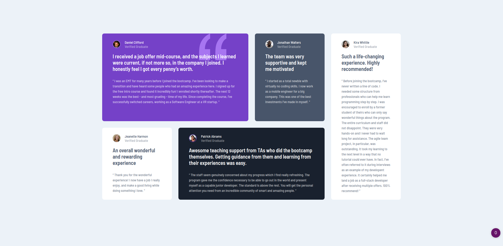

# Frontend Mentor - Testimonials Grid Section

Testimonials grid section design from the website Frontend Mentor.
https://www.frontendmentor.io/challenges/testimonials-grid-section-Nnw6J7Un7

Likewise in the last project, I used a lot of nested divs and some of them are the same but with different data. Also I used the grid style with the help from this site griddy.io

This is the preview I made:

Live: https://billgeorgop93.github.io/Testimonials-Grid-Section/
